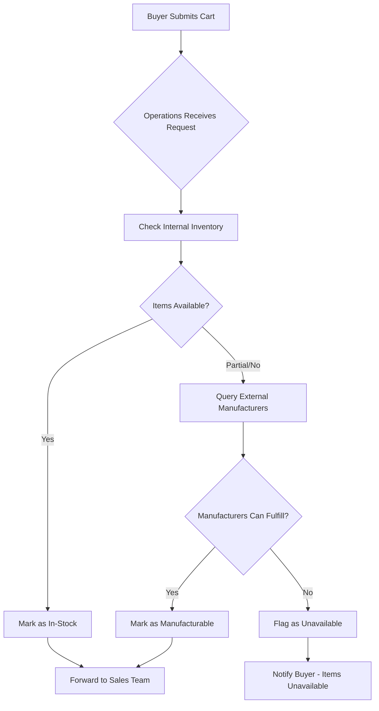
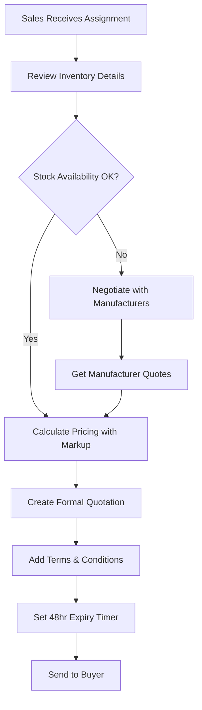
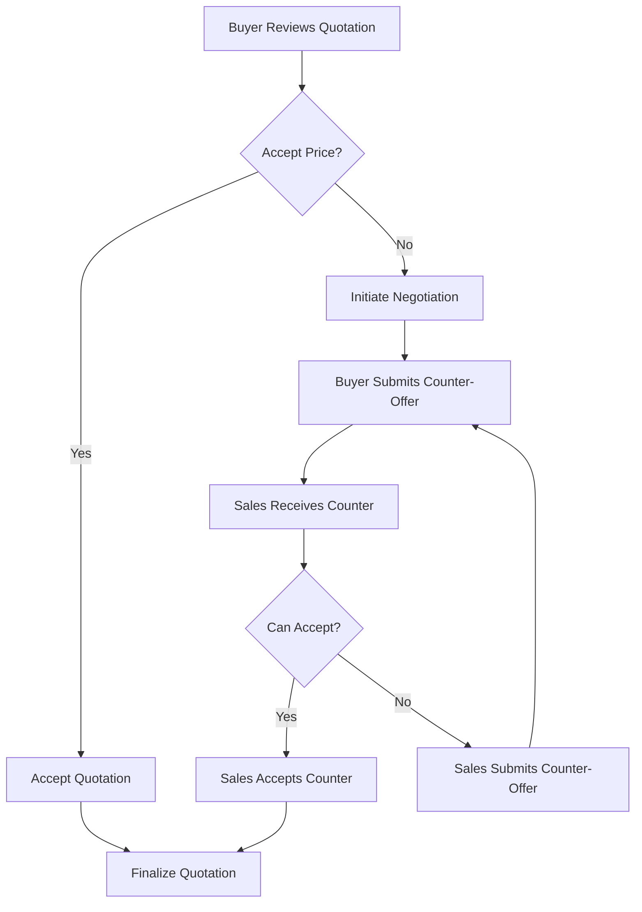
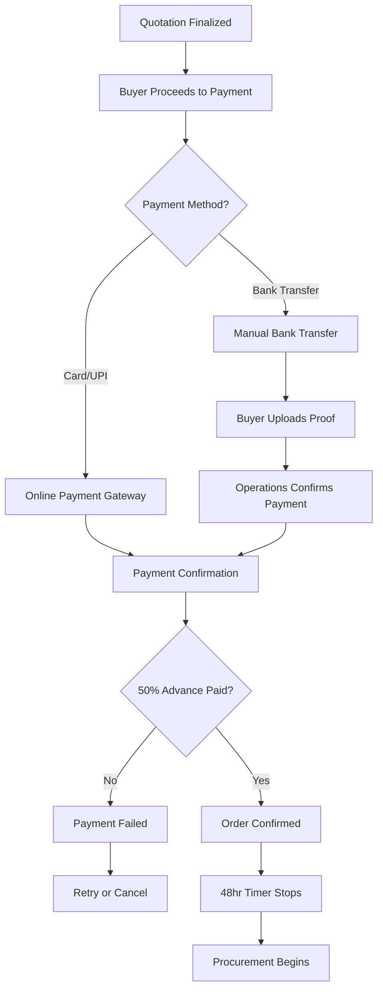
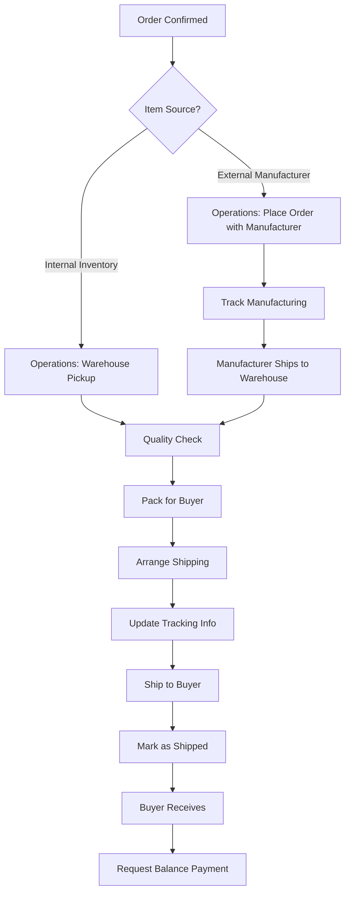
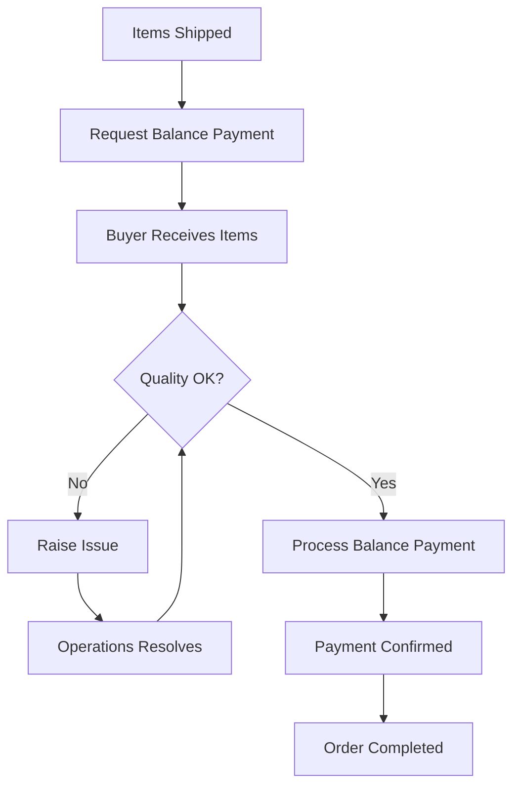
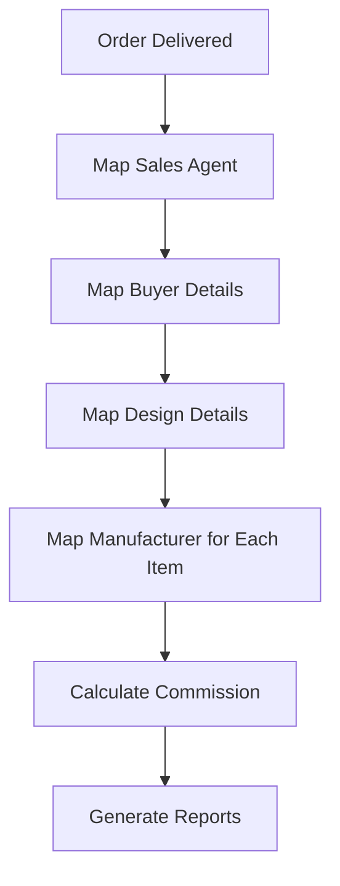

# B2B Jewelry Quotation & Order Fulfillment Workflow Design

**Document Version:** 1.0  
**Date:** February 17, 2026  
**Author:** System Design & Business Analysis  
**Status:** Complete Workflow Definition

---

## Table of Contents
1. [Executive Summary](#executive-summary)
2. [Application Architecture Deep-Dive](#application-architecture-deep-dive)
3. [Quotation Tracker — Full Phased Lifecycle](#quotation-tracker--full-phased-lifecycle)
4. [Current State Analysis](#current-state-analysis)
5. [Complete Workflow Definition](#complete-workflow-definition)
6. [Role Definitions & Responsibilities](#role-definitions--responsibilities)
7. [System Requirements](#system-requirements)
8. [Data Model & Entities](#data-model--entities)
9. [Business Rules](#business-rules)
10. [Missing Components & Gaps](#missing-components--gaps)
11. [Implementation Roadmap](#implementation-roadmap)
12. [Success Metrics](#success-metrics)

> 📖 **See also:** [`docs/QUOTATION-WORKFLOW.md`](./QUOTATION-WORKFLOW.md) for a concise quotation-only reference.

---

## Executive Summary

### Purpose
This document defines a **clear, efficient, and automated workflow** for the B2B jewelry quotation and order fulfillment process. The workflow ensures:
- Timely responses to buyer requests
- Accurate inventory visibility (internal + external manufacturers)
- Smooth negotiation process
- Secure payment handling with 48-hour expiry rules
- Proper dispatch coordination
- Complete data mapping for tracking and reporting

### Scope
The workflow covers the **entire lifecycle**:
```
Quotation Request → Inventory Check → Quotation Creation → Negotiation → 
Payment (50% Advance) → Fulfillment/Dispatch → Final Payment → Post-Closure Mapping
```

### Key Stakeholders
- **Buyer (B2B Client)**: Initiates requests, negotiates, makes payments
- **Operations Team**: Validates inventory availability, manages fulfillment, coordinates with manufacturers
- **Sales Team**: Creates quotations, manages negotiations, handles buyer communication
- **External Manufacturers**: Third-party suppliers for production

---

## Application Architecture Deep-Dive

### App Structure & Role-Based Routing

The platform consists of **two frontend apps** and **one API backend**:

| App | Path | Purpose |
|-----|------|---------|
| **Web** (`apps/web`) | `localhost:3000` | All users — buyer portal, sales views, ops views, admin views |
| **Dashboard** (`apps/dashboard`) | `localhost:3001` | Internal users only — operations & sales workspace |
| **API** (`packages/api`) | `localhost:3002` | NestJS backend with 15 modules |

### Authentication & Login Flow

```
                         ┌─────────────────┐
                         │  /login (Web)   │
                         │ Email + Password │
                         └────────┬────────┘
                                  │
                          JWT Token Issued
                           (id, email, userType)
                                  │
                    ┌─────────────┼─────────────┐
                    ▼             ▼              ▼
              external       sales/ops        admin
                    │             │              │
                    ▼             ▼              ▼
               /app/*      /sales/* OR      /admin/*
            (Buyer UI)     /ops/*           (Full access)
                         Also: Dashboard
                         app at :3001
```

**Middleware rules:**
- `/app/*` → only `external` users (buyers)
- `/ops/*` → only `operations` or `admin` users
- `/sales/*` → only `sales` or `admin` users
- `/admin/*` → only `admin` users
- Dashboard app → blocks `external` users, redirects them to `/app`
- Internal users invited via admin → activate at `/activate-invite` with JWT token

### All Application Routes

#### Buyer Routes (`/app/*`)
| Route | Description |
|-------|-------------|
| `/app` | Buyer dashboard — onboarding progress, category cards |
| `/app/upload` | Upload jewelry design image with category selection |
| `/app/onboarding` | Business profile setup |
| `/app/recommendations/:sessionId` | View AI-matched products from uploaded image |
| `/app/cart` | View/redirect to draft cart |
| `/app/cart/:id` | Cart detail — items, quotations, negotiation UI, accept/reject |
| `/app/requests` | List all submitted requests with status timeline |
| `/app/quotations` | List received quotations with accept/reject/expire status |
| `/app/orders` | Orders with payment initiation and shipment tracking |

#### Operations Routes (`/ops/*`)
| Route | Description |
|-------|-------------|
| `/ops` | Operations dashboard — metrics, system health |
| `/ops/requests` | All quote requests with thumbnails and status badges |
| `/ops/requests/:id` | Request detail — quotation creation |
| `/ops/inventory` | Inventory management |
| `/ops/health` | System health — API sync, scraper status |
| `/ops/orders` | Orders & fulfillment management |
| `/ops/markup` | Markup configuration |
| `/ops/approvals` | Product approval queue |
| `/ops/suppliers` | Supplier management CRUD |
| `/ops/manufacturers` | Manufacturer profiles with products |
| `/ops/manufacturers/:id` | Manufacturer detail |
| `/ops/manufacturers/new` | Create manufacturer |

#### Sales Routes (`/sales/*`)
| Route | Description |
|-------|-------------|
| `/sales` | Sales dashboard — assigned requests, commissions |
| `/sales/requests` | Quote requests with status filters |
| `/sales/quotations` | Quote builder — pending/sent/all tabs |
| `/sales/buyers` | Buyer list |
| `/sales/commissions` | Commission reports |
| `/sales/messages` | Message center |

#### Admin Routes (`/admin/*`)
| Route | Description |
|-------|-------------|
| `/admin` | Admin dashboard — all stats, recent requests |
| `/admin/requests` | All requests |
| `/admin/requests/:id` | Full request review |
| `/admin/team` | User management — invite internal users |
| `/admin/health` | System health |
| `/admin/inventory` | Full inventory CRUD |
| `/admin/markup` | Markup settings |
| `/admin/orders` | Order fulfillment |
| `/admin/approvals` | Product approvals |
| `/admin/suppliers` | Supplier management |
| `/admin/buyers` | Buyer overview |
| `/admin/commissions` | Commission tracking |
| `/admin/messages` | Message center |
| `/admin/quotations` | Quotation management |

#### Dashboard App Routes (`apps/dashboard`)
| Route | Description |
|-------|-------------|
| `/` | Combined ops+sales dashboard with notifications |
| `/requests` | Customer requests table |
| `/requests/:id` | Full request detail with quotation builder |
| `/quotations` | Quotation queue |
| `/inventory` | Inventory management |
| `/users` | Buyer list |
| `/commissions` | Commission reports |
| `/messages` | Chat conversations |
| `/sales/quotations` | Sales quote builder |
| `/settings` | Margin settings |
| `/settings/users` | User management & invites |
| `/ops/health` | System health |
| `/ops/inventory` | Full inventory CRUD (1000+ line page) |
| `/ops/markup` | Markup management |
| `/ops/orders` | Order fulfillment |
| `/ops/approvals` | Product approvals |
| `/ops/suppliers` | Supplier management |

### All API Endpoints Summary

#### Auth (`/api/auth`)
| Method | Path | Auth | Description |
|--------|------|------|-------------|
| POST | `/auth/register` | Public | Register buyer |
| POST | `/auth/login` | Public | Login |
| POST | `/auth/refresh` | Auth | Refresh token |
| POST | `/auth/activate-internal` | Public | Activate invited user |

#### Images (`/api/images`)
| Method | Path | Description |
|--------|------|-------------|
| POST | `/images/upload` | Upload jewelry image |
| GET | `/images/sessions/:id` | Get session |
| GET | `/images/sessions` | List sessions |

#### Carts (`/api/carts`)
| Method | Path | Description |
|--------|------|-------------|
| POST | `/carts` | Create cart |
| GET | `/carts` | List carts |
| GET | `/carts/draft` | Get/create draft cart |
| GET | `/carts/:id` | Get cart |
| POST | `/carts/:id/items` | Add item |
| PUT | `/carts/:cartId/items/:itemId` | Update item |
| DELETE | `/carts/:cartId/items/:itemId` | Remove item |
| POST | `/carts/:id/submit` | Submit for quote |

#### Quotations — Internal (`/api/quotations`)
| Method | Path | Description |
|--------|------|-------------|
| GET | `/quotations/requests` | List submitted requests |
| GET | `/quotations/requests/:cartId` | Request details |
| PUT | `/quotations/requests/:cartId/status` | Update status |
| POST | `/quotations` | Create quotation |
| PUT | `/quotations/:id` | Update draft quotation |
| POST | `/quotations/:id/send` | Send to buyer |

#### Orders — Buyer (`/api/orders`)
| Method | Path | Description |
|--------|------|-------------|
| GET | `/orders/my-quotations` | Buyer's quotations |
| GET | `/orders/quotations/:id` | View quotation (auto-expire check) |
| POST | `/orders/quotations/:id/accept` | Accept → create order |
| POST | `/orders/quotations/:id/reject` | Reject |
| GET | `/orders/mine` | Buyer's orders |
| GET | `/orders/:id` | Order detail |
| POST | `/orders/:id/pay` | Initiate payment |
| POST | `/orders/expire-check` | Cron: expire old quotations |

#### Sales (`/api/sales`)
| Method | Path | Description |
|--------|------|-------------|
| GET | `/sales/dashboard` | Metrics |
| GET | `/sales/requests/:cartId` | Request detail with messages |
| POST | `/sales/check-stock` | Check SKU stock |
| GET | `/sales/markup/:cat/:source` | Get applicable markup |
| POST | `/sales/quotations` | Create quotation |
| POST | `/sales/quotations/:id/send` | Send quotation (48h expiry) |
| PUT | `/sales/quotations/:id/revise` | Revise sent quotation |
| POST | `/sales/quotations/:id/convert-order` | Convert to order |
| GET | `/sales/requests/:cartId/messages` | Get messages |
| POST | `/sales/requests/:cartId/messages` | Send message |
| GET | `/sales/commissions` | Commission report |
| GET | `/sales/buyers` | List buyers |

#### Operations (`/api/operations`)
| Method | Path | Description |
|--------|------|-------------|
| GET | `/operations/dashboard` | Dashboard metrics |
| GET | `/operations/health` | System health |
| GET/POST | `/operations/markup` | Markup configs |
| GET/PUT | `/operations/scraper-config` | Alibaba scraper |
| GET/POST/PUT | `/operations/suppliers` | Supplier CRUD |
| GET/POST | `/operations/products/pending`, `approve`, `reject` | Product approval |
| GET/PUT | `/operations/orders` | Order management |
| POST/PUT | `/operations/procurement` | Procurement records |
| POST/PUT | `/operations/shipments` | Shipments |
| FULL CRUD | `/operations/inventory` | Inventory management |
| FULL CRUD | `/operations/manufacturer-catalog` | Manufacturer items |
| FULL CRUD | `/operations/alibaba-catalog` | Alibaba items |
| FULL CRUD | `/operations/manufacturers` | Manufacturer profiles |
| POST | `/operations/payments/:id/confirm` | Confirm bank payment |
| POST/PUT | `/operations/stock-check`, `stock-status` | Stock management |

#### Negotiations — Internal (`/api/internal/negotiations`)
| Method | Path | Description |
|--------|------|-------------|
| POST | `/internal/negotiations` | Open negotiation |
| GET | `/internal/negotiations/by-quotation/:qid` | Get by quotation |
| GET | `/internal/negotiations/:id` | Get by ID |
| POST | `/internal/negotiations/:id/counter` | Seller counter |
| POST | `/internal/negotiations/:id/accept` | Seller accept |
| POST | `/internal/negotiations/:id/close` | Close negotiation |

#### Negotiations — Buyer (`/api/negotiations`)
| Method | Path | Description |
|--------|------|-------------|
| GET | `/negotiations/by-quotation/:qid` | Buyer get negotiation |
| POST | `/negotiations/:id/counter` | Buyer counter |
| POST | `/negotiations/:id/accept` | Buyer accept |
| POST | `/negotiations/:id/close` | Buyer close |

---

## Quotation Tracker — Full Phased Lifecycle

> The quotation is the **central artifact** of this platform. Everything flows through it.  
> Below is the complete 8-phase lifecycle with the exact actors, APIs, and status transitions.

### The 8 Phases at a Glance

```
PHASE 1        PHASE 2           PHASE 3        PHASE 4         PHASE 5
Buyer          Operations        Sales          Buyer           Buyer ↔ Sales
┌────────┐     ┌────────────┐    ┌──────────┐   ┌──────────┐   ┌──────────┐
│ Submit │ ──▶ │  Validate  │ ──▶│  Create  │──▶│  Review  │──▶│Negotiate │
│  Cart  │     │  Inventory │    │   Quote  │   │  Quote   │   │ (opt.)   │
└────────┘     └────────────┘    └──────────┘   └──────────┘   └──────────┘
                                                     │               │
                                              ┌──────┼──────┐        │
                                              ▼      ▼      ▼        ▼
                                         PHASE 6  PHASE 7   │   Back to Ph.6
                                         Accept   Reject    Expire
                                         & Pay              (→ Ph.2 recheck)
                                           │
                                           ▼
                                        PHASE 8
                                        Fulfillment
                                        & Close
```

### Phase 1 — Buyer Submits Cart

| | Detail |
|---|---|
| **Actor** | Buyer |
| **Route** | `/app/cart/:id` → "Submit for Quote" |
| **API** | `POST /api/carts/:id/submit` |
| **Cart status** | `draft` → `submitted` |
| **Quotation** | Not yet created |

**Process:**
1. Buyer builds cart from AI recommendations (internal inventory + manufacturer items)
2. Adds quantities, notes, delivery preferences, urgency
3. Clicks "Submit for Quote"
4. System validates cart has ≥ 1 item, locks cart from edits
5. Notifications sent to Operations team and Sales team

**Notifications:** `new_request` → Operations users + Sales users

---

### Phase 2 — Operations Validates Inventory ⭐ NEW

| | Detail |
|---|---|
| **Actor** | Operations team |
| **Route** | `/ops/requests/:id` or Dashboard `/requests/:id` |
| **API** | `POST /api/operations/carts/:id/validate-inventory` *(NEW)* |
| **Cart status** | `submitted` → `under_review` |

**Process:**
1. Operations opens request — sees buyer info, items, AI attributes
2. **Per-item inventory check:**
   - **Internal items**: Query `inventory_skus.availableQuantity` vs requested qty
     - `in_stock` / `low_stock` / `out_of_stock`
   - **Manufacturer items**: Query `manufacturer_catalog.stockStatus` + manufacturer active/verified
     - `available` / `made_to_order` / `unavailable`
3. Operations adds notes per item (procurement challenges, alternatives)
4. Clicks **"Forward to Sales"** → assigns specific sales person
5. Cart status → `under_review`, validation results stored per CartItem

**New CartItem fields:**
| Field | Purpose |
|-------|---------|
| `inventoryStatus` | in_stock / low_stock / out_of_stock / available / made_to_order / unavailable |
| `availableSource` | internal / manufacturer / alibaba |
| `validatedQuantity` | Confirmed available qty |
| `operationsNotes` | Ops team notes |
| `validatedAt` | Validation timestamp |
| `validatedById` | Who validated |

**New IntendedCart fields:**
| Field | Purpose |
|-------|---------|
| `assignedSalesId` | Assigned sales person |
| `assignedAt` | When assigned |
| `validatedByOpsId` | Who validated |

**Notification:** `request_validated` → Assigned sales person

---

### Phase 3 — Sales Creates Quotation

| | Detail |
|---|---|
| **Actor** | Sales team |
| **Route** | `/sales/quotations` or Dashboard `/sales/quotations` |
| **API** | `POST /api/sales/quotations` |
| **Quotation status** | **`draft`** (created) |

**Process:**
1. Sales sees validated request with inventory status per item
2. Calculates pricing per item:
   - Internal: `baseCost × (1 + marginPercentage / 100)`
   - Manufacturer: `midpoint(baseCostMin, baseCostMax) × (1 + margin / 100)`
3. Uses markup hierarchy: category+source → category → source → global default
4. Prepares formal quotation:
   - Line items with final unit prices
   - Payment terms: "50% advance, balance post-dispatch"
   - Validity: 48 hours from send time
   - Delivery timelines, terms & conditions
5. Saves as `draft` — not visible to buyer yet
6. Can preview, adjust, save multiple times

---

### Phase 4 — Sales Sends / Buyer Reviews

| | Detail |
|---|---|
| **Actors** | Sales sends → Buyer reviews |
| **API (send)** | `POST /api/sales/quotations/:id/send` |
| **API (view)** | `GET /api/orders/quotations/:id` |
| **Quotation** | `draft` → `sent` |
| **Cart** | `under_review` → `quoted` |

**On send:**
- `sentAt` = now, `expiresAt` = now + 48 hours
- Buyer receives notification + email
- Cart status → `quoted`

**Buyer sees:**
- All items with final pricing, terms, delivery
- **48-hour countdown timer**
- Three action buttons: **Accept**, **Negotiate**, **Reject**

**Auto-expiry:** If `expiresAt` passed and still `sent` → status auto-set to `expired`

**Notifications:** `quote_sent` → Buyer | `quote_expiring` (at 36hrs) → Buyer | `quote_expired` (at 48hrs) → Buyer + Sales

---

### Phase 5 — Negotiation (Optional)

| | Detail |
|---|---|
| **Actors** | Buyer ↔ Sales (turn-based) |
| **Negotiation states** | `open` → `counter_buyer` ↔ `counter_seller` → `accepted` / `rejected` |

**Process:**
```
Round 0:  Sales opens negotiation → original prices (status: open)
Round 1:  Buyer proposes new prices (status: counter_buyer)
Round 2:  Sales responds (status: counter_seller)
Round N:  Continue until accept or reject

ACCEPT:   Last round's prices → update quotation items
          Buyer can then Accept (Phase 6)
REJECT:   Negotiation closed, quotation unchanged
```

**Rules:**
- Turn-based enforcement (buyer can't counter twice in a row)
- Each round tracked: proposer, prices, quantities, message, timestamp
- If quotation expires during negotiation → negotiation auto-closes

---

### Phase 6 — Acceptance & Payment

| | Detail |
|---|---|
| **Actor** | Buyer |
| **Quotation** | `sent` → `accepted` |
| **Order** | Created with status `pending_payment` → `confirmed` |

**Step A — Accept:**
1. Buyer clicks "Accept & Pay"
2. System creates Order (links quotation, buyer, sales person)
3. Order number generated: `ORD-XXXXX`
4. Cart → `closed`

**Step B — 50% Advance Payment:**
- **Card / UPI**: Instant processing → `paid` → order `confirmed`
- **Bank Transfer**: Status `pending` → Operations confirms → `paid` → order `confirmed`

**48-Hour Payment Window:**
```
If no payment within 48hrs of order creation:
→ order.status = 'recheck'
→ quotation.status = 'expired'
→ Operations must re-validate inventory (restart Phase 2)
```

**Notifications:** `quote_accepted` → Sales | `order_created` → Buyer | `payment_confirmed` → Buyer + Operations | `payment_expiring` (at 36hrs) → Buyer

---

### Phase 7 — Rejection

| | Detail |
|---|---|
| **Actor** | Buyer |
| **API** | `POST /api/orders/quotations/:id/reject` |
| **Quotation** | `sent` → `rejected` |

Buyer provides optional rejection reason. Sales notified. Cart can be re-submitted.

---

### Phase 8 — Fulfillment & Closure

| | Detail |
|---|---|
| **Actors** | Operations (procure/ship) → Sales (balance) → Buyer (confirm) |
| **Order** | `confirmed` → `in_procurement` → `shipped` → `delivered` |

**Step A — Procurement:**
- Internal items: Pick from warehouse, deduct inventory
- Manufacturer items: Place PO, track production
- `ProcurementRecord` created per source

**Step B — Dispatch:**
- All items ready → Pack → Ship → `Shipment` record with tracking
- Order → `shipped`

**Step C — Balance Payment:**
- Sales requests remaining 50%: `balanceDue = totalAmount - paidAmount`
- Buyer pays balance

**Step D — Delivery & Closure:**
- Buyer confirms receipt → Order → `delivered`
- Commission calculated: `deliveredAmount × commissionRate`
- Manufacturer attribution stored per item

---

### Quotation Tracker — Visual Display Per Role

**Buyer sees:**
```
● Submitted        ✓ Feb 15 2:30 PM
● Under Review     ✓ Feb 15 4:15 PM  (Validated by Ops)
● Quote Received   ✓ Feb 16 10:00 AM
○ Your Response    ← YOU ARE HERE (expires Feb 18 10:00 AM)
○ Payment
○ Confirmed
○ Shipped
○ Delivered
```

**Sales sees:**
```
● Request Received    ✓ Feb 15 2:30 PM
● Ops Validated       ✓ Feb 15 4:15 PM  (3/3 items available)
● Quote Drafted       ✓ Feb 16 9:45 AM
● Quote Sent          ✓ Feb 16 10:00 AM (expires 48h)
○ Buyer Response      ← WAITING
○ Negotiation
○ Order & Payment
○ Fulfilled
```

**Operations sees:**
```
● Received            ✓ Feb 15 2:30 PM
○ Validate Inventory  ← YOUR ACTION
○ Forward to Sales
○ Quoted
○ Order Confirmed
○ Procurement
○ Shipped
○ Delivered
```

---

## Current State Analysis

### What's Already Implemented ✅

Based on codebase analysis, the following is **already built**:

#### Database Schema (Prisma)
- ✅ **User Management**: Users with roles (external, sales, operations, admin)
- ✅ **Inventory**: `InventorySku` with stock quantities, base costs
- ✅ **Manufacturers**: `Manufacturer` and `ManufacturerCatalog` for external suppliers
- ✅ **Carts**: `IntendedCart` and `CartItem` with status tracking
- ✅ **Quotations**: `Quotation` and `QuotationItem` with pricing
- ✅ **Negotiations**: `Negotiation`, `NegotiationRound`, `NegotiationRoundItem`
- ✅ **Orders**: `Order` and `OrderItem` with status tracking
- ✅ **Payments**: `Payment` with multiple payment methods (card, bank_transfer, upi)
- ✅ **Commissions**: Commission tracking for sales personnel
- ✅ **Shipments**: Shipment tracking
- ✅ **Procurement**: `ProcurementRecord` for external sourcing
- ✅ **Notifications**: System notifications
- ✅ **Messages**: Buyer-Sales communication
- ✅ **Margin Configuration**: Admin-configurable markup settings

#### Backend Services (NestJS)
- ✅ **QuotationsService**: Create, update, send quotations
- ✅ **NegotiationsService**: Open negotiations, submit counter-offers
- ✅ **OrdersService**: Accept/reject quotations, create orders, initiate payments
- ✅ **OperationsService**: Dashboard metrics, markup management, product approval, procurement
- ✅ **SalesService**: Quote preparation, stock checking, markup application

### What's Fragmented/Incomplete ❌

#### Missing Workflow Connections
1. **No automated inventory check trigger** when quotation requests arrive
2. **No automatic inventory source detection** (internal vs. manufacturer)
3. **Payment expiry automation** is not connected to quotation revalidation
4. **Post-closure mapping** is incomplete (no manufacturer assignment on delivered items)
5. **Operations-to-Sales handoff** is not clearly defined
6. **Commission calculation** is not triggered on delivery
7. **48-hour payment expiry** is defined but not enforced with automated recheck workflow
8. **Notifications** exist but key workflow triggers are missing

#### Business Logic Gaps
1. No **inventory availability check** before quotation creation
2. No **manufacturer capacity lookup** for out-of-stock items
3. No **automatic quote expiry** handling with recheck status
4. No **balance payment collection** workflow after dispatch
5. No **delivered quantity tracking** for commission calculation
6. Missing **supplier assignment** for each order item

---

## Complete Workflow Definition

### Phase 1: Quotation Initiation & Inventory Check



#### Step 1.1: Cart Submission
**Actor:** Buyer  
**System:** Web App  

**Process:**
1. Buyer reviews selected items in cart
2. Adds quantities for each item
3. Submits cart for quotation request
4. System changes cart status: `draft` → `submitted`
5. System creates notification for Operations Team

**Data Captured:**
- Cart ID
- Buyer ID
- Cart Items (with recommendation sources)
- Submission timestamp

**Current Status:** ✅ Implemented (CartService)

---

#### Step 1.2: Operations Receives Request
**Actor:** Operations Team  
**System:** Operations Dashboard  

**Process:**
1. Operations team receives notification
2. Opens request details showing:
   - Buyer information
   - Requested items with images
   - Quantities requested
   - Item sources (inventory vs. manufacturer)

**Data Displayed:**
- Buyer: name, company, contact, purchase history
- Items: name, SKU, image, requested quantity, source type
- Recommendation metadata

**Current Status:** ✅ Implemented (OperationsService.getOrders)

---

#### Step 1.3: Inventory Availability Check
**Actor:** Operations Team / System (Automated)  
**System:** Inventory Module  

**Process:**
1. **For each cart item**, check inventory availability:
   
   **Internal Inventory Check:**
   ```sql
   SELECT 
     id, skuCode, name, availableQuantity, baseCost, leadTimeDays
   FROM inventory_skus
   WHERE id = :inventorySkuId 
     AND isActive = true
     AND availableQuantity >= :requestedQuantity
   ```
   
   **If available:**
   - Mark item as `source: internal`
   - Capture: SKU code, available quantity, base cost, lead time

   **If unavailable or insufficient quantity:**
   - Proceed to manufacturer check

2. **External Manufacturer Check:**
   ```sql
   SELECT 
     mc.id, mc.name, mc.baseCostMin, mc.baseCostMax, 
     mc.moq, mc.leadTimeDays, mc.stockStatus,
     m.companyName, m.avgLeadTimeDays
   FROM manufacturer_catalog mc
   JOIN manufacturers m ON mc.manufacturerId = m.id
   WHERE mc.id = :manufacturerItemId
     AND mc.isVerified = true
     AND m.isActive = true
   ```

   **If manufacturable:**
   - Mark item as `source: manufacturer`
   - Capture: Manufacturer ID, estimated cost range, MOQ, lead time
   - Store manufacturer details for later procurement

3. **Validation Result:**
   - All items available → **Ready for quotation**
   - Some items unavailable → **Partial fulfillment** (sales decision)
   - Critical items unavailable → **Notify buyer for substitution**

**Data Updated:**
- Cart item → inventory validation status
- Cart item → source type (internal/manufacturer)
- Cart item → supplier reference (if manufacturer)

**Current Status:** ❌ **MISSING** - No automated inventory check workflow

---

#### Step 1.4: Operations Handoff to Sales
**Actor:** Operations Team  
**System:** Operations Dashboard → Sales Dashboard  

**Process:**
1. Operations reviews inventory check results
2. Adds internal notes about:
   - Stock availability
   - Manufacturer lead times
   - Any procurement challenges
3. Changes cart status: `submitted` → `under_review`
4. **Assigns request to Sales Team member**
5. System notifies assigned salesperson

**Data Captured:**
- Operations notes
- Assigned sales person ID
- Status change timestamp
- Inventory validation results

**Current Status:** ⚠️ **PARTIAL** - Status change exists, but assignment and structured handoff missing

---

### Phase 2: Formal Quotation Creation



#### Step 2.1: Sales Reviews Request
**Actor:** Sales Team  
**System:** Sales Dashboard  

**Process:**
1. Sales receives notification of assigned request
2. Reviews:
   - Buyer profile and history
   - Requested items with inventory status
   - Operations notes
   - Recommended pricing based on markup rules

**Data Displayed:**
- Buyer details
- Item details with:
  - Source type (internal/manufacturer)
  - Base cost
  - Applicable markup %
  - Suggested selling price
  - MOQ and lead time

**Current Status:** ✅ Implemented (SalesService.getQuoteRequestDetails)

---

#### Step 2.2: Pricing Calculation
**Actor:** Sales Team / System  
**System:** Pricing Engine  

**Process:**

1. **Apply Markup Rules:**
   ```typescript
   // Lookup applicable markup
   const markup = await getApplicableMarkup(category, sourceType)
   
   // For Internal Inventory
   finalPrice = baseCost × (1 + markup.marginPercentage / 100)
   
   // For Manufacturer Items
   estimatedCostMin = baseCostMin × (1 + markup.marginPercentage / 100)
   estimatedCostMax = baseCostMax × (1 + markup.marginPercentage / 100)
   ```

2. **Sales can adjust pricing within bounds:**
   - Cannot go below `baseCost + minMarkup`
   - Should not exceed `baseCost + maxMarkup`
   - System shows warning if outside bounds

**Markup Hierarchy** (most specific first):
1. Category + Source Type specific
2. Category specific
3. Source Type specific
4. Global default

**Data Calculated:**
- Final unit price per item
- Line total per item
- Quotation total

**Current Status:** ✅ Implemented (SalesService.getApplicableMarkup)

---

#### Step 2.3: Create Formal Quotation
**Actor:** Sales Team  
**System:** Quotations Module  

**Process:**
1. Sales compiles quotation with:
   - Buyer details
   - Design specifications (pulled from cart items)
   - Quantity and unit price for each item
   - Total amount including taxes
   - Payment terms: **"50% advance payment required, balance due post-dispatch"**
   - **Validity period: 48 hours from sending**
   - Delivery timelines
   - Terms and conditions

2. System creates `Quotation` record:
   ```typescript
   {
     cartId: string,
     createdById: salesPersonId,
     quotedTotal: Decimal,
     validUntil: Date (now + 48 hours),
     terms: string,
     status: 'draft',
     items: QuotationItem[]
   }
   ```

3. Sales reviews quotation in preview mode
4. Makes any necessary adjustments
5. **Sends quotation to buyer**

**On Send:**
- Status changes: `draft` → `sent`
- `sentAt` timestamp recorded
- `expiresAt` set to 48 hours from send time
- Email notification sent to buyer with quotation link
- System notification created

**Data Created:**
- Quotation record
- Quotation items (linked to cart items)
- Expiry timestamp
- Notification to buyer

**Current Status:** ✅ Implemented (SalesService.createQuotation, sendQuotation)

---

### Phase 3: Negotiation



#### Step 3.1: Buyer Receives Quotation
**Actor:** Buyer  
**System:** Web App  

**Process:**
1. Buyer receives email with quotation link
2. Logs in to view quotation details:
   - All items with pricing
   - Total amount
   - Payment terms
   - Delivery timeline
   - **Expiry countdown timer** (48 hours)

**Actions Available:**
- **Accept quotation** → Proceed to payment
- **Initiate negotiation** → Open negotiation flow
- **Reject quotation** → Provide reason

**Current Status:** ✅ Implemented (OrdersService.acceptQuotation, rejectQuotation)

---

#### Step 3.2: Negotiation Process
**Actor:** Buyer & Sales Team  
**System:** Negotiations Module  

**Process:**

1. **Buyer Opens Negotiation:**
   - Clicks "Request Changes" on quotation
   - System creates `Negotiation` record
   - Status: `open`
   - Round 0 created with original quotation prices

2. **Buyer Submits Counter-Offer:**
   - Proposes new prices for items
   - Adds message/justification
   - System creates `NegotiationRound` with `roundNumber++`
   - Status changes to: `counter_buyer`
   - Sales team receives notification

3. **Sales Reviews Counter-Offer:**
   - Reviews proposed prices
   - Checks against minimum acceptable margins
   - Options:
     - **Accept counter-offer** → Update quotation prices
     - **Reject counter-offer** → Close negotiation
     - **Submit counter-counter-offer** → New round

4. **Negotiation Rounds Continue:**
   - Each round tracked with:
     - Round number
     - Proposer (buyer or sales)
     - Proposed prices per item
     - Messages
     - Timestamp

5. **Negotiation Ends When:**
   - Either party accepts
   - Either party rejects
   - Quotation expires (48 hours)

**Negotiation States:**
- `open` - Buyer can counter
- `counter_buyer` - Sales should respond
- `counter_seller` - Buyer should respond
- `accepted` - Agreement reached
- `rejected` - Negotiation failed
- `closed` - Manually closed

**Data Tracked:**
- Negotiation ID
- All rounds with proposers
- Price changes over time
- Messages exchanged
- Final agreed prices

**Current Status:** ✅ Implemented (NegotiationsService)

---

### Phase 4: Payment Processing



#### Step 4.1: Payment Initiation
**Actor:** Buyer  
**System:** Payment Module  

**Process:**

1. **After accepting quotation**, buyer proceeds to payment
2. System creates `Order` record:
   ```typescript
   {
     quotationId: string,
     buyerId: string,
     salesPersonId: string,
     orderNumber: string, // ORD-XXXXX
     status: 'pending_payment',
     totalAmount: quotedTotal,
     paidAmount: 0,
     deliveredAmount: 0
   }
   ```

3. **Buyer selects payment method:**
   - Credit/Debit Card
   - UPI
   - Bank Transfer

4. **Calculate required advance:**
   ```typescript
   advanceAmount = totalAmount × 0.50 // 50% advance
   ```

**Current Status:** ✅ Implemented (OrdersService.acceptQuotation)

---

#### Step 4.2: Online Payment (Card/UPI)
**Actor:** Buyer  
**System:** Payment Gateway Integration  

**Process:**

1. Buyer enters payment details
2. System creates `Payment` record:
   ```typescript
   {
     orderId: string,
     amount: advanceAmount,
     method: 'card' | 'upi',
     status: 'processing',
     expiresAt: new Date(now + 48 hours)
   }
   ```

3. **Payment gateway processes payment:**
   - Integration with Razorpay/Stripe
   - Gateway returns transaction reference
   - System updates payment:
     ```typescript
     {
       status: 'paid',
       gatewayRef: string,
       paidAt: Date,
       gatewayResponse: JSON
     }
     ```

4. **On successful payment:**
   - Update order: `paidAmount += amount`
   - Check if `paidAmount >= totalAmount * 0.50`
   - If yes, change order status: `pending_payment` → `confirmed`
   - **Stop 48-hour expiry timer**
   - Send confirmation email to buyer
   - **Notify operations team** to begin procurement

**Current Status:** ✅ Implemented (OrdersService.initiatePayment) - but needs real payment gateway integration

---

#### Step 4.3: Bank Transfer Payment
**Actor:** Buyer, Operations Team  
**System:** Payment Module  

**Process:**

1. **Buyer selects Bank Transfer:**
   - System displays bank account details
   - Buyer makes manual bank transfer
   - System creates payment record with status: `pending`

2. **Buyer uploads payment proof:**
   - Screenshot/PDF of bank transaction
   - Transaction reference number
   - Payment amount

3. **Operations team verifies payment:**
   - Reviews bank statement
   - Matches transaction reference
   - Confirms amount received
   - Updates payment:
     ```typescript
     {
       status: 'paid',
       confirmedById: operationsUserId,
       paidAt: Date
     }
     ```

4. **Same confirmation flow as online payment**

**Current Status:** ⚠️ **PARTIAL** - Payment record exists, but proof upload and manual confirmation flow missing

---

#### Step 4.4: Payment Expiry Handling
**Actor:** System (Automated)  
**System:** Background Job  

**Process:**

1. **Background job runs every hour:**
   ```typescript
   // Find payments that expired
   const expiredPayments = await Payment.findMany({
     where: {
       status: 'pending',
       expiresAt: { lt: new Date() }
     }
   })
   ```

2. **For each expired payment:**
   - Update payment status: `pending` → `expired`
   - Update associated quotation: `status` → `expired`
   - Update order status: `pending_payment` → `recheck`

3. **Notify buyer:**
   - "Your quotation has expired. Inventory and pricing need revalidation."
   - Option to request new quotation

4. **Notify sales team:**
   - "Quote expired for Order #XXXXX"
   - Requires operations to recheck inventory and pricing

**Recheck Workflow:**
1. Operations reviews order
2. Checks current inventory availability
3. Verifies manufacturer pricing still valid
4. Sales creates new quotation if buyer requests
5. New 48-hour timer starts

**Current Status:** ❌ **MISSING** - Expiry check automation and recheck workflow not implemented

---

### Phase 5: Order Fulfillment & Dispatch



#### Step 5.1: Procurement Planning
**Actor:** Operations Team  
**System:** Procurement Module  

**Process:**

1. **Operations receives order confirmation:**
   - Reviews order items
   - Identifies source for each item:
     - Internal inventory items
     - Manufacturer items

2. **For each order item, create procurement record:**
   ```typescript
   ProcurementRecord {
     orderId: string,
     supplierId: string | null, // null for internal
     source: 'inventory' | 'manufacturer',
     status: 'pending',
     notes: string,
     orderedAt: Date | null,
     expectedAt: Date | null,
     receivedAt: Date | null
   }
   ```

**Current Status:** ✅ Implemented (ProcurementRecord schema exists)

---

#### Step 5.2: Internal Inventory Fulfillment
**Actor:** Operations Team  
**System:** Inventory + Warehouse Management  

**Process:**

1. **Generate pick list:**
   - List all internal inventory items
   - With SKU codes, quantities, warehouse locations

2. **Warehouse team picks items:**
   - Physically retrieves items
   - Performs quality check
   - Updates inventory:
     ```sql
     UPDATE inventory_skus
     SET availableQuantity = availableQuantity - :orderedQuantity
     WHERE id = :skuId
     ```

3. **Update procurement record:**
   ```typescript
   {
     status: 'received',
     receivedAt: new Date()
   }
   ```

**Current Status:** ⚠️ **PARTIAL** - Schema exists, but inventory deduction workflow missing

---

#### Step 5.3: External Manufacturer Procurement
**Actor:** Operations Team  
**System:** Procurement Module  

**Process:**

1. **Operations contacts manufacturer:**
   - Sends purchase order (PO) with:
     - Product specifications
     - Quantity
     - Delivery deadline
     - Price agreement
   
2. **Create PO in system:**
   ```typescript
   {
     supplierId: manufacturerId,
     source: 'manufacturer',
     status: 'ordered',
     poNumber: 'PO-XXXXX',
     orderedAt: new Date(),
     expectedAt: Date (based on lead time),
     notes: 'Manufacturer: XYZ Co.'
   }
   ```

3. **Track manufacturing progress:**
   - Regular updates from manufacturer
   - Status updates:
     - `ordered` → `in_production` → `ready_to_ship` → `shipped` → `received`

4. **Receive from manufacturer:**
   - Quality inspection
   - Mark as received
   ```typescript
   {
     status: 'received',
     receivedAt: new Date()
   }
   ```

**Current Status:** ⚠️ **PARTIAL** - Schema exists, status tracking not implemented

---

#### Step 5.4: Dispatch to Buyer
**Actor:** Operations Team  
**System:** Shipment Module  

**Process:**

1. **All items for order received:**
   - Check all procurement records status = `received`

2. **Pack items:**
   - Quality check
   - Secure packaging
   - Generate packing list

3. **Arrange shipping:**
   - Select courier/carrier
   - Generate shipping label
   - Create shipment record:
     ```typescript
     Shipment {
       orderId: string,
       trackingNumber: string,
       carrier: string,
       status: 'preparing',
       shippedAt: Date | null,
       deliveredAt: Date | null,
       notes: string
     }
     ```

4. **Ship to buyer:**
   - Hand over to courier
   - Update shipment:
     ```typescript
     {
       status: 'shipped',
       shippedAt: new Date()
     }
     ```

5. **Update order status:**
   ```sql
   UPDATE orders
   SET status = 'shipped'
   WHERE id = :orderId
   ```

6. **Notify buyer:**
   - Email with tracking details
   - In-app notification with tracking link

**Current Status:** ✅ Implemented (Shipment schema exists)

---

#### Step 5.5: Delivery Confirmation
**Actor:** Operations Team / Buyer  
**System:** Order Module  

**Process:**

1. **Track delivery status:**
   - Integrate with courier API for real-time tracking
   - Update shipment status based on courier updates

2. **Buyer confirms delivery:**
   - Marks order as received
   - Option to report issues

3. **System updates:**
   ```typescript
   // Update shipment
   {
     status: 'delivered',
     deliveredAt: new Date()
   }
   
   // Update order
   {
     status: 'delivered',
     deliveredAmount: totalAmount // All items delivered
   }
   ```

4. **Trigger commission calculation** (see Phase 6)

**Current Status:** ⚠️ **PARTIAL** - Schema exists, delivery confirmation workflow missing

---

### Phase 6: Balance Payment Collection



#### Step 6.1: Balance Payment Request
**Actor:** Sales Team  
**System:** Payment Module  

**Process:**

1. **After shipment, sales requests balance:**
   ```typescript
   balanceDue = totalAmount - paidAmount
   ```

2. **Send payment request to buyer:**
   - Email notification
   - Shows amount due
   - Payment link

3. **Buyer makes balance payment:**
   - Same payment methods as advance
   - Creates new Payment record:
     ```typescript
     {
       orderId: string,
       amount: balanceDue,
       method: 'card' | 'upi' | 'bank_transfer',
       status: 'processing'
     }
     ```

4. **On successful payment:**
   ```typescript
   // Update order
   {
     paidAmount: paidAmount + balanceDue,
     status: paidAmount >= totalAmount ? 'delivered' : 'partially_delivered'
   }
   ```

**Current Status:** ❌ **MISSING** - Balance payment workflow not implemented

---

### Phase 7: Post-Closure Mapping



#### Step 7.1: Data Mapping on Order Closure
**Actor:** System (Automated)  
**System:** Order + Commission Module  

**Process:**

1. **When order status = 'delivered':**

2. **Map Sales Agent:**
   ```typescript
   const salesAgent = await User.findUnique({
     where: { id: order.salesPersonId }
   })
   
   // Already linked via order.salesPersonId
   ```

3. **Map Buyer Details:**
   ```typescript
   const buyer = await User.findUnique({
     where: { id: order.buyerId },
     include: { company, contact details }
   })
   
   // Already linked via order.buyerId
   ```

4. **Map Designs Ordered:**
   ```typescript
   const orderItems = await OrderItem.findMany({
     where: { orderId: order.id },
     include: {
       quotationItem: {
         include: {
           cartItem: {
             include: {
               recommendationItem: {
                 include: {
                   inventorySku: true,
                   manufacturerItem: true
                 }
               }
             }
           }
         }
       }
     }
   })
   ```

5. **Map End Manufacturer for Each Item:**
   ```typescript
   for (const item of orderItems) {
     const procurement = await ProcurementRecord.findFirst({
       where: { orderId: order.id },
       include: { supplier: true }
     })
     
     // Store manufacturer assignment
     await OrderItem.update({
       where: { id: item.id },
       data: {
         // Need to add manufacturerId field to OrderItem
         manufacturerId: procurement.supplierId,
         manufacturerName: procurement.supplier?.name
       }
     })
   }
   ```

**Current Status:** ⚠️ **PARTIAL** - Relationships exist, but automatic mapping workflow missing

---

#### Step 7.2: Commission Calculation
**Actor:** System (Automated)  
**System:** Commission Module  

**Process:**

1. **Trigger on order delivery:**
   ```typescript
   // When deliveredAmount updated
   if (order.status === 'delivered') {
     await calculateCommission(order.id)
   }
   ```

2. **Calculate commission:**
   ```typescript
   const salesPerson = await User.findUnique({
     where: { id: order.salesPersonId }
   })
   
   const commissionRate = salesPerson.commissionRate || 5.00 // Default 5%
   
   const commissionAmount = order.deliveredAmount × (commissionRate / 100)
   
   await Commission.create({
     orderId: order.id,
     salesPersonId: order.salesPersonId,
     commissionRate: commissionRate,
     deliveredValue: order.deliveredAmount,
     commissionAmount: commissionAmount,
     status: 'pending'
   })
   ```

3. **For partial deliveries:**
   ```typescript
   // Commission calculated on delivered quantity only
   const deliveredItems = orderItems.filter(item => item.deliveredQty > 0)
   
   for (const item of deliveredItems) {
     const itemValue = item.unitPrice × item.deliveredQty
     const itemCommission = itemValue × (commissionRate / 100)
     
     // Add to total commission
   }
   ```

**Current Status:** ⚠️ **PARTIAL** - Schema exists, but automatic calculation workflow missing

---

## Role Definitions & Responsibilities

### 1. Operations Team

**Primary Responsibilities:**
- ✅ Receive and review incoming quotation requests
- ✅ Validate inventory availability (internal + external)
- ✅ Coordinate with external manufacturers for capacity
- ✅ Forward validated requests to Sales Team
- ✅ Manage procurement and fulfillment
- ✅ Coordinate warehouse operations
- ✅ Handle shipping and logistics
- ✅ Confirm manual payments (bank transfers)
- ✅ Manage system configurations (markups, suppliers)

**Dashboard Access:**
- New quote requests count
- Pending approvals
- Active orders by status
- System health (API sync status, Alibaba scrape status)
- Markup configuration
- Supplier management
- Product approval queue

**Workflow Entry Points:**
- Cart submission notification → Inventory check
- Order confirmation → Procurement
- Manufacturer coordination
- Shipment dispatch

---

### 2. Sales Team

**Primary Responsibilities:**
- ✅ Receive inventory-validated requests from Operations
- ✅ Prepare formal quotations with pricing
- ✅ Communicate with buyers
- ✅ Manage negotiations
- ✅ Finalize quotations
- ✅ Request balance payments
- ✅ Track commissions

**Dashboard Access:**
- Assigned quote requests
- Pending quotations
- Active negotiations
- Orders in progress
- Commission tracker
- Buyer communication history

**Workflow Entry Points:**
- Operations handoff → Quotation creation
- Buyer negotiation → Counter-offers
- Shipment confirmation → Balance payment request

---

### 3. Buyer (B2B Client)

**Primary Responsibilities:**
- ✅ Upload design images
- ✅ Build cart with recommendations
- ✅ Submit quotation requests
- ✅ Review quotations
- ✅ Negotiate pricing
- ✅ Make payments (advance + balance)
- ✅ Track orders
- ✅ Confirm delivery

**Portal Access:**
- Design upload and search
- Cart management
- Quotation inbox
- Negotiation interface
- Payment gateway
- Order tracking
- Past orders and invoices

**Workflow Entry Points:**
- Design upload → Cart creation
- Cart submission → Quotation request
- Quotation received → Accept/Negotiate/Reject
- Order confirmed → Payment
- Order shipped → Delivery confirmation

---

### 4. External Manufacturers

**Primary Responsibilities:**
- ✅ Provide product capacity and pricing
- ✅ Accept purchase orders
- ✅ Manufacture products
- ✅ Ship to company warehouse
- ✅ Provide progress updates

**System Integration:**
- Manufacturer portal (future)
- Email-based PO system (current)
- Manual status updates by Operations

**Workflow Entry Points:**
- Operations sends PO → Manufacturing
- Progress updates → System status updates
- Shipment → Warehouse receipt

---

## System Requirements

### Functional Requirements

#### FR-1: Inventory Check Automation
**Priority:** HIGH  
**Status:** ❌ MISSING  

**Description:**
When a cart is submitted, automatically check inventory availability for each item:
- Query internal inventory for stock levels
- Query manufacturer catalog for external options
- Flag items as available/unavailable
- Store source type for each item

**Acceptance Criteria:**
- Cart submission triggers inventory check
- Results stored in cart item metadata
- Operations sees availability status
- Unavailable items flagged for buyer notification

---

#### FR-2: Payment Expiry Automation
**Priority:** HIGH  
**Status:** ❌ MISSING  

**Description:**
Automatically expire quotations after 48 hours of non-payment and trigger recheck workflow.

**Acceptance Criteria:**
- Background job runs hourly
- Expired payments marked as `expired`
- Associated quotations marked as `expired`
- Orders moved to `recheck` status
- Notifications sent to buyer and sales team
- Recheck workflow initiated

---

#### FR-3: Balance Payment Collection
**Priority:** MEDIUM  
**Status:** ❌ MISSING  

**Description:**
After dispatch, sales can request balance payment from buyer.

**Acceptance Criteria:**
- Sales can trigger balance payment request
- Buyer receives payment notification
- Payment gateway supports balance payment
- Order status updates on full payment
- Commission calculated only after full payment

---

#### FR-4: Commission Auto-Calculation
**Priority:** MEDIUM  
**Status:** ❌ MISSING  

**Description:**
Automatically calculate sales commission when order is delivered.

**Acceptance Criteria:**
- Triggered on order status = `delivered`
- Commission = deliveredAmount × commissionRate
- Commission record created with status `pending`
- Partial delivery supported (commission on delivered qty only)
- Sales can view commission dashboard

---

#### FR-5: Manufacturer Mapping
**Priority:** MEDIUM  
**Status:** ❌ MISSING  

**Description:**
Map each order item to the actual manufacturer who produced it.

**Acceptance Criteria:**
- Procurement record links item to manufacturer
- Order item stores manufacturer reference
- Reports show manufacturer breakdown
- Commission reports include manufacturer attribution

---

#### FR-6: Operations-Sales Handoff
**Priority:** HIGH  
**Status:** ⚠️ PARTIAL  

**Description:**
Clear workflow for Operations to assign validated requests to Sales team.

**Acceptance Criteria:**
- Operations can assign request to specific salesperson
- Salesperson receives notification
- Request shows inventory validation results
- Operations notes visible to Sales

---

#### FR-7: Inventory Deduction
**Priority:** HIGH  
**Status:** ❌ MISSING  

**Description:**
Automatically reduce inventory when items are picked for an order.

**Acceptance Criteria:**
- When procurement record marked as `received` for internal items
- Inventory quantity reduced by ordered amount
- Low stock alerts triggered
- Inventory history tracked

---

### Non-Functional Requirements

#### NFR-1: Performance
- Inventory check completes within 5 seconds
- Quotation generation within 2 seconds
- Payment processing within 10 seconds
- Dashboard loads within 3 seconds

#### NFR-2: Reliability
- Payment expiry job runs every hour without failure
- Email notifications 99.9% delivery rate
- Data integrity maintained across transactions

#### NFR-3: Security
- Payment gateway PCI-DSS compliant
- User authentication required for all operations
- Role-based access control enforced
- Sensitive data encrypted at rest

#### NFR-4: Scalability
- Support 100+ concurrent users
- Handle 1000+ quotations per day
- Scale to 10,000+ inventory items
- Support 100+ manufacturers

---

## Data Model & Entities

### Core Entities (Already Implemented ✅)

```typescript
User {
  id: UUID
  email: string
  userType: 'external' | 'sales' | 'operations' | 'admin'
  commissionRate: Decimal
  // Relationships
  quotationsCreated: Quotation[]
  buyerOrders: Order[]
  salesOrders: Order[]
  commissions: Commission[]
}

IntendedCart {
  id: UUID
  userId: UUID (buyer)
  status: 'draft' | 'submitted' | 'under_review' | 'quoted' | 'closed'
  submittedAt: Date
  // Relationships
  items: CartItem[]
  quotations: Quotation[]
  messages: Message[]
}

CartItem {
  id: UUID
  cartId: UUID
  recommendationItemId: UUID
  quantity: int
  // Relationships
  recommendationItem: RecommendationItem
}

RecommendationItem {
  id: UUID
  sourceType: 'inventory' | 'manufacturer' | 'alibaba'
  inventorySkuId: UUID (nullable)
  manufacturerItemId: UUID (nullable)
  // Relationships
  inventorySku: InventorySku
  manufacturerItem: ManufacturerCatalog
}

InventorySku {
  id: UUID
  skuCode: string
  name: string
  baseCost: Decimal
  availableQuantity: int
  leadTimeDays: int
}

Manufacturer {
  id: UUID
  companyName: string
  avgLeadTimeDays: int
  // Relationships
  products: ManufacturerCatalog[]
}

ManufacturerCatalog {
  id: UUID
  manufacturerId: UUID
  name: string
  baseCostMin: Decimal
  baseCostMax: Decimal
  moq: int
  leadTimeDays: int
}

Quotation {
  id: UUID
  cartId: UUID
  createdById: UUID (sales person)
  quotedTotal: Decimal
  validUntil: Date
  status: 'draft' | 'sent' | 'accepted' | 'rejected' | 'expired'
  sentAt: Date
  expiresAt: Date
  terms: string
  // Relationships
  items: QuotationItem[]
  negotiation: Negotiation
  orders: Order[]
}

QuotationItem {
  id: UUID
  quotationId: UUID
  cartItemId: UUID
  finalUnitPrice: Decimal
  quantity: int
  lineTotal: Decimal
}

Negotiation {
  id: UUID
  quotationId: UUID
  status: 'open' | 'counter_buyer' | 'counter_seller' | 'accepted' | 'rejected'
  // Relationships
  rounds: NegotiationRound[]
}

NegotiationRound {
  id: UUID
  negotiationId: UUID
  roundNumber: int
  proposedById: UUID
  proposedTotal: Decimal
  message: string
  // Relationships
  items: NegotiationRoundItem[]
}

Order {
  id: UUID
  quotationId: UUID
  buyerId: UUID
  salesPersonId: UUID
  orderNumber: string
  status: 'pending_payment' | 'confirmed' | 'in_procurement' | 
          'shipped' | 'delivered' | 'cancelled' | 'recheck'
  totalAmount: Decimal
  paidAmount: Decimal
  deliveredAmount: Decimal
  // Relationships
  items: OrderItem[]
  payments: Payment[]
  shipments: Shipment[]
  procurement: ProcurementRecord[]
  commissions: Commission[]
}

OrderItem {
  id: UUID
  orderId: UUID
  quotationItemId: UUID
  source: 'inventory' | 'manufacturer' | 'alibaba'
  productName: string
  skuCode: string
  quantity: int
  unitPrice: Decimal
  lineTotal: Decimal
  deliveredQty: int
}

Payment {
  id: UUID
  orderId: UUID
  amount: Decimal
  method: 'card' | 'bank_transfer' | 'upi'
  status: 'pending' | 'processing' | 'paid' | 'failed' | 'expired'
  paidAt: Date
  expiresAt: Date
  gatewayRef: string
}

Shipment {
  id: UUID
  orderId: UUID
  trackingNumber: string
  carrier: string
  status: 'preparing' | 'shipped' | 'delivered'
  shippedAt: Date
  deliveredAt: Date
}

ProcurementRecord {
  id: UUID
  orderId: UUID
  supplierId: UUID (nullable)
  source: 'inventory' | 'manufacturer'
  status: 'pending' | 'ordered' | 'in_production' | 'received'
  poNumber: string
  orderedAt: Date
  expectedAt: Date
  receivedAt: Date
}

Commission {
  id: UUID
  orderId: UUID
  salesPersonId: UUID
  commissionRate: Decimal
  deliveredValue: Decimal
  commissionAmount: Decimal
  status: 'pending' | 'approved' | 'paid'
}
```

### Schema Enhancements Needed

#### 1. Add to `CartItem`:
```prisma
model CartItem {
  // ... existing fields
  
  // NEW: Inventory validation metadata
  inventoryStatus      String?  @map("inventory_status") // 'in_stock' | 'manufacturable' | 'unavailable'
  availableSource      String?  @map("available_source") // 'internal' | 'manufacturer'
  manufacturerRef      String?  @map("manufacturer_ref") @db.Uuid
  operationsNotes      String?  @map("operations_notes")
  validatedAt          DateTime? @map("validated_at")
}
```

#### 2. Add to `Order`:
```prisma
model Order {
  // ... existing fields
  
  // NEW: Assignment tracking
  assignedToSalesAt   DateTime? @map("assigned_to_sales_at")
  assignedByOpsId     String?   @map("assigned_by_ops_id") @db.Uuid
  
  // Relationship
  assignedByOps       User?     @relation("orders_assigned_by_ops", fields: [assignedByOpsId], references: [id])
}
```

#### 3. Add to `OrderItem`:
```prisma
model OrderItem {
  // ... existing fields
  
  // NEW: Manufacturer mapping
  actualManufacturerId String?  @map("actual_manufacturer_id") @db.Uuid
  manufacturerName     String?  @map("manufacturer_name")
  procurementRecordId  String?  @map("procurement_record_id") @db.Uuid
  
  // Relationship
  actualManufacturer   Manufacturer? @relation(fields: [actualManufacturerId], references: [id])
  procurementRecord    ProcurementRecord? @relation(fields: [procurementRecordId], references: [id])
}
```

#### 4. Add to `Payment`:
```prisma
model Payment {
  // ... existing fields
  
  // NEW: Payment proof for manual verification
  proofDocumentUrl    String?  @map("proof_document_url")
  verificationNotes   String?  @map("verification_notes")
}
```

---

## Business Rules

### BR-1: Quotation Validity
- **Rule:** All quotations are valid for **48 hours** from the time they are sent to the buyer.
- **Enforcement:** 
  - `expiresAt` timestamp set when quotation sent
  - Background job checks expiry every hour
  - Expired quotations cannot be accepted
- **Exception:** Sales can manually extend validity with approval

### BR-2: Payment Terms
- **Rule:** **50% advance payment required** before order confirmation. Balance due after dispatch.
- **Enforcement:**
  - Order cannot move to `confirmed` until `paidAmount >= totalAmount * 0.50`
  - Balance payment requested after shipment
  - Order marked `delivered` only after full payment
- **Exception:** None - strictly enforced

### BR-3: Payment Expiry
- **Rule:** If advance payment not received within 48 hours of quotation acceptance, quote expires.
- **Enforcement:**
  - Payment `expiresAt` set to 48 hours from quotation acceptance
  - Expired payments trigger order status → `recheck`
  - Inventory and pricing must be revalidated
- **Exception:** Buyer can request extension (requires sales approval)

### BR-4: Inventory Priority
- **Rule:** Internal inventory is **always prioritized** over external manufacturers.
- **Enforcement:**
  - Inventory check searches internal stock first
  - Only if unavailable, check external manufacturers
  - Recommendation items tagged with source type
- **Exception:** Buyer specifically requests manufacturer source

### BR-5: Commission Calculation
- **Rule:** Commission calculated on **delivered value only**, not ordered value.
- **Enforcement:**
  - Commission triggered when order status = `delivered`
  - Formula: `deliveredAmount × commissionRate`
  - Partial deliveries: commission on partial value only
- **Exception:** None

### BR-6: Manufacturer Mapping
- **Rule:** Every delivered item must be mapped to the manufacturer who produced it.
- **Enforcement:**
  - Procurement record links order to manufacturer
  - Order item updated with manufacturer reference on delivery
  - Reports require manufacturer attribution
- **Exception:** Internal inventory items (manufacturer = "Internal")

### BR-7: Negotiation Limits
- **Rule:** Sales cannot accept prices below minimum markup threshold.
- **Enforcement:**
  - System calculates `minimumPrice = baseCost + minMarkup`
  - Negotiation prices below minimum require admin approval
  - System shows warning if below threshold
- **Exception:** Admin can override for strategic deals

### BR-8: Inventory Deduction
- **Rule:** Inventory deducted only when items physically picked, not at order creation.
- **Enforcement:**
  - Inventory quantity reduced when procurement status = `received`
  - Low stock alerts triggered at threshold
  - Inventory history logged
- **Exception:** Can reserve inventory at order creation (future feature)

---

## Missing Components & Gaps

### Critical Gaps (Block Workflow) 🔴

#### 1. Inventory Check Automation
**Current:** Manual check by operations  
**Needed:** Automated inventory availability check on cart submission  
**Impact:** Without this, operations team manually validates each request, causing delays  
**Dependencies:** None  
**Effort:** Medium (2-3 days)  

#### 2. Payment Expiry Automation
**Current:** Manual expiry tracking  
**Needed:** Background job to expire payments and trigger recheck workflow  
**Impact:** Quotes stay open indefinitely, inventory not protected  
**Dependencies:** Background job scheduler  
**Effort:** Medium (2-3 days)  

#### 3. Operations-Sales Assignment
**Current:** Implicit handoff  
**Needed:** Explicit assignment mechanism with notifications  
**Impact:** Unclear ownership, requests fall through cracks  
**Dependencies:** Notification system  
**Effort:** Low (1-2 days)  

---

### High Priority Gaps (Workflow Incomplete) 🟡

#### 4. Balance Payment Collection
**Current:** Only advance payment implemented  
**Needed:** Balance payment workflow after dispatch  
**Impact:** Revenue collection incomplete, manual tracking needed  
**Dependencies:** Payment gateway integration  
**Effort:** Medium (3-4 days)  

#### 5. Commission Auto-Calculation
**Current:** Manual commission tracking  
**Needed:** Automatic calculation on delivery  
**Impact:** Commission disputes, delayed payouts  
**Dependencies:** Delivery confirmation  
**Effort:** Low (1-2 days)  

#### 6. Inventory Deduction
**Current:** Manual inventory management  
**Needed:** Automatic stock reduction on procurement  
**Impact:** Overselling risk, inaccurate stock levels  
**Dependencies:** Procurement workflow  
**Effort:** Medium (2-3 days)  

#### 7. Manufacturer Mapping
**Current:** Procurement records exist but not linked to items  
**Needed:** Automatic manufacturer assignment on delivery  
**Impact:** Cannot track which manufacturer made which item  
**Dependencies:** Procurement completion  
**Effort:** Low (1 day)  

---

### Medium Priority Gaps (Nice to Have) 🟢

#### 8. Payment Proof Upload
**Current:** Bank transfer not fully supported  
**Needed:** Document upload for payment verification  
**Impact:** Manual verification difficult  
**Dependencies:** File upload service  
**Effort:** Low (1-2 days)  

#### 9. Manufacturer Status Tracking
**Current:** Basic procurement status  
**Needed:** Detailed manufacturing progress updates  
**Impact:** Limited visibility into production  
**Dependencies:** Manufacturer integration  
**Effort:** High (5+ days, requires manufacturer portal)  

#### 10. Advanced Reporting
**Current:** Basic metrics  
**Needed:** Manufacturer attribution reports, commission reports  
**Impact:** Limited business insights  
**Dependencies:** Data mapping completion  
**Effort:** Medium (3-4 days)  

---

## Implementation Roadmap

### Phase 1: Critical Workflow Completion (Week 1-2)
**Goal:** Enable end-to-end workflow without manual intervention

#### Sprint 1.1: Inventory & Assignment (Week 1)
- [ ] **Task 1.1.1:** Implement inventory check automation
  - Add inventory validation logic
  - Update CartItem schema with validation metadata
  - Create inventory check service method
  - Trigger on cart submission
  
- [ ] **Task 1.1.2:** Implement Operations-Sales assignment
  - Add assignment fields to Order schema
  - Create assignment UI in Operations dashboard
  - Add assignment notification
  - Update Sales dashboard to show assigned requests

- [ ] **Task 1.1.3:** Testing
  - Test cart submission → inventory check
  - Test assignment workflow
  - Verify notifications

#### Sprint 1.2: Payment Expiry & Automation (Week 2)
- [ ] **Task 1.2.1:** Implement payment expiry background job
  - Create cron job for hourly expiry check
  - Expire payments and quotations
  - Move orders to `recheck` status
  - Send notifications to buyer and sales

- [ ] **Task 1.2.2:** Implement recheck workflow
  - Create recheck UI for operations
  - Reinitiate inventory validation
  - Allow sales to create new quotation
  - Reset 48-hour timer

- [ ] **Task 1.2.3:** Testing
  - Test expiry after 48 hours
  - Verify recheck workflow
  - Test notifications

---

### Phase 2: Payment & Fulfillment (Week 3-4)

#### Sprint 2.1: Balance Payment (Week 3)
- [ ] **Task 2.1.1:** Implement balance payment workflow
  - Add balance payment request UI for sales
  - Create payment request notification for buyer
  - Update payment gateway to support balance payment
  - Update order status on full payment

- [ ] **Task 2.1.2:** Implement payment proof upload
  - Add file upload for bank transfer proof
  - Create verification UI for operations
  - Update payment confirmation workflow

- [ ] **Task 2.1.3:** Testing
  - Test balance payment request
  - Test payment proof upload and verification
  - Verify order status updates

#### Sprint 2.2: Inventory & Procurement (Week 4)
- [ ] **Task 2.2.1:** Implement inventory deduction
  - Trigger on procurement status = `received`
  - Update inventory quantity
  - Create inventory history log
  - Add low stock alerts

- [ ] **Task 2.2.2:** Enhance procurement tracking
  - Add manufacturing status updates
  - Create procurement status timeline
  - Add expected delivery dates

- [ ] **Task 2.2.3:** Testing
  - Test inventory deduction on procurement
  - Verify stock level accuracy
  - Test low stock alerts

---

### Phase 3: Post-Closure & Reporting (Week 5-6)

#### Sprint 3.1: Commission & Mapping (Week 5)
- [ ] **Task 3.1.1:** Implement commission auto-calculation
  - Trigger on order delivery
  - Calculate commission based on delivered value
  - Support partial deliveries
  - Create commission records

- [ ] **Task 3.1.2:** Implement manufacturer mapping
  - Link order items to manufacturers via procurement
  - Update OrderItem schema
  - Auto-populate on delivery

- [ ] **Task 3.1.3:** Testing
  - Test commission calculation
  - Test partial delivery commission
  - Verify manufacturer mapping

#### Sprint 3.2: Reporting & Analytics (Week 6)
- [ ] **Task 3.2.1:** Build commission reports
  - Sales commission dashboard
  - Commission by period
  - Pending vs. paid commissions

- [ ] **Task 3.2.2:** Build manufacturer reports
  - Orders by manufacturer
  - Manufacturer performance
  - Lead time analysis

- [ ] **Task 3.2.3:** Build order analytics
  - Order lifecycle reports
  - Payment status dashboard
  - Fulfillment metrics

- [ ] **Task 3.2.4:** Testing
  - Verify report accuracy
  - Test data exports
  - Performance testing

---

### Phase 4: Polish & Optimization (Week 7-8)

#### Sprint 4.1: UI/UX Improvements
- [ ] Enhanced notifications with action buttons
- [ ] Real-time status updates
- [ ] Improved mobile responsiveness
- [ ] Onboarding tutorials

#### Sprint 4.2: Performance & Scalability
- [ ] Database query optimization
- [ ] Caching implementation
- [ ] Background job optimization
- [ ] Load testing

#### Sprint 4.3: Documentation & Training
- [ ] User guides for each role
- [ ] API documentation
- [ ] Admin training materials
- [ ] Video tutorials

---

## Success Metrics

### Operational Metrics

#### Response Time
- **Target:** 90% of quotation requests receive initial response within 24 hours
- **Measurement:** Time between cart submission and quotation sent
- **Current Baseline:** TBD (manual tracking)

#### Quotation Accuracy
- **Target:** <5% of quotations require price revision
- **Measurement:** Number of revised quotations / total quotations
- **Current Baseline:** TBD

#### Payment Collection Rate
- **Target:** 95% of accepted quotations receive advance payment within 48 hours
- **Measurement:** Payments received / quotations accepted
- **Current Baseline:** TBD

#### Order Fulfillment Time
- **Target:** 90% of orders shipped within promised timeline
- **Measurement:** Actual ship date vs. promised date
- **Current Baseline:** TBD

---

### Financial Metrics

#### Revenue Leakage
- **Target:** <2% of orders cancelled due to payment expiry
- **Measurement:** Expired orders / total orders
- **Current Baseline:** TBD

#### Commission Accuracy
- **Target:** 100% of commissions calculated within 24 hours of delivery
- **Measurement:** Commission records created / deliveries
- **Current Baseline:** 0% (manual)

#### Balance Payment Collection
- **Target:** 98% of balance payments collected within 7 days of delivery
- **Measurement:** Balance payments / shipments
- **Current Baseline:** TBD

---

### System Metrics

#### Automation Rate
- **Target:** 80% of workflow steps automated (no manual intervention)
- **Measurement:** Automated steps / total workflow steps
- **Current Baseline:** ~40% (estimated)

#### Data Completeness
- **Target:** 100% of delivered orders have manufacturer mapping
- **Measurement:** Orders with manufacturer data / total orders
- **Current Baseline:** 0%

#### Notification Delivery
- **Target:** 99.5% of notifications delivered within 1 minute
- **Measurement:** Notifications delivered on time / total notifications
- **Current Baseline:** TBD

---

### User Satisfaction Metrics

#### Buyer Satisfaction
- **Target:** 4.5/5 average rating for quotation process
- **Measurement:** Post-quotation survey
- **Current Baseline:** TBD

#### Sales Team Efficiency
- **Target:** 30% reduction in time spent per quotation
- **Measurement:** Time tracking per quotation
- **Current Baseline:** TBD

#### Operations Team Efficiency
- **Target:** 50% reduction in manual inventory checks
- **Measurement:** Manual checks / total checks
- **Current Baseline:** 100%

---

## Appendix

### A. Database Migration Scripts

#### Migration 1: Add Inventory Validation to CartItem
```sql
ALTER TABLE cart_items
ADD COLUMN inventory_status VARCHAR(30),
ADD COLUMN available_source VARCHAR(30),
ADD COLUMN manufacturer_ref UUID,
ADD COLUMN operations_notes TEXT,
ADD COLUMN validated_at TIMESTAMP;
```

#### Migration 2: Add Assignment Tracking to Order
```sql
ALTER TABLE orders
ADD COLUMN assigned_to_sales_at TIMESTAMP,
ADD COLUMN assigned_by_ops_id UUID REFERENCES users(id);
```

#### Migration 3: Add Manufacturer Mapping to OrderItem
```sql
ALTER TABLE order_items
ADD COLUMN actual_manufacturer_id UUID REFERENCES manufacturers(id),
ADD COLUMN manufacturer_name VARCHAR(255),
ADD COLUMN procurement_record_id UUID REFERENCES procurement_records(id);
```

#### Migration 4: Add Payment Proof to Payment
```sql
ALTER TABLE payments
ADD COLUMN proof_document_url VARCHAR(500),
ADD COLUMN verification_notes TEXT;
```

---

### B. API Endpoints to Implement

#### Operations Endpoints
```
POST   /api/operations/carts/:cartId/validate-inventory
POST   /api/operations/carts/:cartId/assign-to-sales
GET    /api/operations/orders/:orderId/recheck
POST   /api/operations/payments/:paymentId/verify
```

#### Sales Endpoints
```
GET    /api/sales/assigned-requests
POST   /api/sales/orders/:orderId/request-balance-payment
```

#### Background Jobs
```
CronJob: ExpirePayments (every hour)
CronJob: CalculateCommissions (daily)
CronJob: SendPaymentReminders (daily)
```

---

### C. Notification Templates

#### Notification 1: Cart Submitted
**To:** Operations Team  
**Trigger:** Cart status → submitted  
**Template:**
```
New quotation request from {buyerName}
{itemCount} items requested
View Request: {requestLink}
```

#### Notification 2: Request Assigned
**To:** Sales Person  
**Trigger:** Cart assigned to sales  
**Template:**
```
New request assigned to you
Buyer: {buyerName}
Items: {itemCount} (validated by operations)
Create Quote: {quoteLink}
```

#### Notification 3: Quotation Sent
**To:** Buyer  
**Trigger:** Quotation status → sent  
**Template:**
```
Your quotation is ready!
Total: {quotedTotal}
Valid until: {expiresAt}
View Quotation: {quotationLink}
```

#### Notification 4: Payment Expiring Soon
**To:** Buyer  
**Trigger:** 36 hours after quotation sent (12 hours before expiry)  
**Template:**
```
⚠️ Your quotation expires in 12 hours
Total: {quotedTotal}
Pay now to secure your order: {paymentLink}
```

#### Notification 5: Payment Expired
**To:** Buyer, Sales  
**Trigger:** Payment status → expired  
**Template:**
```
Your quotation has expired
Inventory and pricing need revalidation
Request new quotation: {requestLink}
```

#### Notification 6: Balance Payment Due
**To:** Buyer  
**Trigger:** Order status → shipped  
**Template:**
```
Your order has been shipped!
Tracking: {trackingNumber}
Balance payment due: {balanceAmount}
Pay now: {paymentLink}
```

---

### D. Business Rules Summary Table

| Rule | Description | Enforcement | Exception Handling |
|------|-------------|-------------|-------------------|
| BR-1 | 48hr quotation validity | Automated expiry | Sales can extend |
| BR-2 | 50% advance payment | Payment validation | None |
| BR-3 | 48hr payment expiry | Background job | Buyer can request extension |
| BR-4 | Internal inventory priority | Search algorithm | Buyer preference |
| BR-5 | Commission on delivered value | Auto-calculation | None |
| BR-6 | Manufacturer mapping required | Data validation | Internal = "Internal" |
| BR-7 | Minimum markup enforcement | Pricing validation | Admin override |
| BR-8 | Inventory deduction on pick | Procurement trigger | Manual adjustment |

---

### E. Workflow State Machine

#### Cart States
```
draft → submitted → under_review → quoted → closed
                 ↘ (rejected)
```

#### Quotation States
```
draft → sent → [accepted | rejected | expired]
           ↘ (negotiation) → revised → sent
```

#### Order States
```
pending_payment → confirmed → in_procurement → shipped → delivered
              ↘ expired → recheck → pending_payment
                       ↘ cancelled
```

#### Payment States
```
pending → processing → [paid | failed | expired]
                    ↘ (manual) → verified → paid
```

#### Negotiation States
```
open → counter_buyer → counter_seller → ... → [accepted | rejected | closed]
```

---

**End of Document**

This comprehensive workflow design serves as the single source of truth for implementing the complete B2B jewelry quotation and order fulfillment system. All stakeholders should refer to this document for business logic, technical requirements, and implementation priorities.
